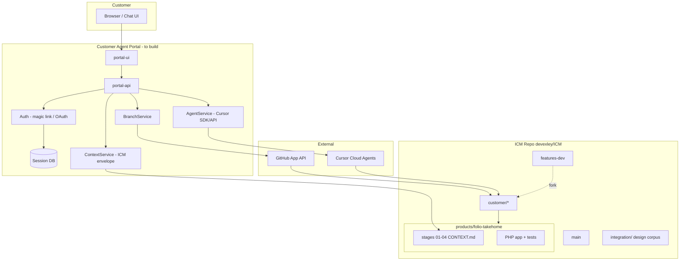

# Customer Agent Enhancement — Validated Architecture

**Repository:** [devexley/ICM](https://github.com/devexley/ICM)  
**Branch reviewed:** `integration-dev` @ `11cfb35`  
**Validation date:** 2026-05-26  
**Status:** **Validated (structure)** — portal not implemented; runtime Folio tests require Docker  
**Audience:** Engineering, product, and agent operators  

---

## Validation certificate

| Check | Result | Evidence |
|-------|--------|----------|
| ICM hub + product structure | **PASS** | `python3 scripts/validate_icm.py` — 0 failures |
| Integration markdown corpus reviewed | **PASS** | 4 design docs + `CONTEXT.md` (see §2) |
| Branch scope documented | **PASS** | `integration-dev` = `features-dev` + commit `11cfb35` |
| Design internal consistency | **PASS** | Branch model, API constraints, and ICM stages aligned across docs |
| Folio runtime tests | **NOT RUN** | Docker not available in validation environment |
| Portal implementation | **N/A** | Design-only; no `products/customer-agent-portal/` yet |

**Validator:** Automated ICM validator + architectural cross-review of `integration/*.md` on `integration-dev`.

**Sign-off criteria for implementation:** Re-run Folio tests with `docker compose exec app php tests/test.php`; complete Phase 0 checklist in §8 before production beta.

---

## 1. Executive summary

### Enhancement

Add a **Customer Agent Portal** on top of this ICM portfolio hub so that customers (authenticated by email) can:

1. Receive a dedicated git branch `customer/{email-slug}` created from `features-dev`.
2. Run **Cursor Cloud Agents** constrained by ICM stage contracts (`products/folio-takehome/stages/*`).
3. Implement and verify Folio features without writing to `main` or `features-dev`.
4. Promote work via human-reviewed PRs when ready.

### What already exists in this repo

| Layer | Capability |
|-------|------------|
| ICM hub | Contract-first routing (`CONTEXT.md`, stages, `validate_icm.py`) |
| Folio product | PHP/SQLite app with staged workflow and Docker tests |
| `features-dev` | Folio timezone / scheduled-publishing fixes (`cc472d1`, `dc327cf`) |
| `integration-dev` | Everything on `features-dev` **plus** integration design corpus (`11cfb35`) |

### What the enhancement adds (net-new)

| Component | Description |
|-----------|-------------|
| Portal UI + API | Auth, branch provisioning, agent orchestration, run status |
| GitHub App | Scoped write to `customer/*`; branch protection on `main` / `features-dev` |
| Cursor integration | Cloud agents with `workOnCurrentBranch` on pre-created customer branches |
| CI (recommended) | Validate ICM + Folio tests on `customer/**` pushes |

---

## 2. Review of `integration/` markdown corpus

### 2.1 `integration/CONTEXT.md` (Layer 2 contract)

**Role:** Defines the standard integration *process* when wiring multiple products: name goal → contracts → `output/integration-plan.md` → per-product implement → `output/smoke-test.md`.

**Gap vs enhancement:** Does not yet reference the customer-agent design set. **Recommendation:** Add a “References” row linking to this validated doc and the portal architecture when implementation starts.

### 2.2 `customer-agent-portal-architecture.md`

**Role:** Primary technical specification (~570 lines).

**Covers:**

- Benefit analysis and phased recommendation (monorepo + branch-per-customer).
- System context (browser → portal → GitHub + Cursor → repo branches).
- Git branching: `main`, `features-dev`, `customer/{email-slug}`.
- Components: UI, API modules, session schema, GitHub App permissions.
- REST/SDK agent launch contracts (`workOnCurrentBranch`, no custom `branchName`).
- ICM context envelope template for agent prompts.
- CI workflow sketch, security model, implementation phases 0–3, smoke tests.

**Validation notes:**

- Aligns with Cursor API reality (pre-create branch; `startingRef` + `workOnCurrentBranch: true`).
- Correctly scopes v1 to `products/folio-takehome/`.
- Promotion path is human-gated (no auto-merge to `features-dev`).

### 2.3 `icm-customer-agent-operation-loop.md`

**Role:** Operational runbook for one customer session.

**Covers:**

- Login → branch ensure → stage-by-stage agent runs (Option A recommended).
- ICM envelope injection, run metadata for UI, verify contract.
- Security invariants and acceptance criteria.

**Validation notes:**

- Option A (one stage per run) is the best fit for ICM audit rules (discovery/design must not change app code).
- Verify commands match Folio stage `04_verify` contract.

### 2.4 `icm-how-it-works-and-product-integration.md`

**Role:** Explains how ICM works in *this* repo and how Folio is integrated via stage dependency paths and verify commands.

**Covers:**

- Hub layers 0/1/3, product stages 01–04, `validate_icm.py` / `icm_run.py`.
- Explicit placement of customer portal under `integration/` as cross-cutting orchestration.

**Validation notes:**

- Accurate mapping to current repo layout.
- HTML export exists as `icm-how-it-works-and-product-integration.html` for offline reading.

### 2.5 Corpus consistency matrix

| Topic | Portal architecture | Operation loop | ICM how-it-works | Consistent |
|-------|---------------------|----------------|------------------|------------|
| Base branch for customers | `features-dev` | `features-dev` | (via portal) | Yes |
| Writable branch | `customer/{slug}` | `customer/{slug}` | — | Yes |
| Protected refs | `main`, `features-dev` | same | same | Yes |
| Agent branch API | pre-create + `workOnCurrentBranch` | same | — | Yes |
| Stage policy | implied | Option A explicit | stage contracts | Yes |
| Verify command | `docker compose` + `tests/test.php` | same | stage 04 | Yes |
| Product scope v1 | folio only | folio only | folio | Yes |

**Conclusion:** The four documents form a coherent, implementable design set with no blocking contradictions.

---

## 3. `integration-dev` branch scope (full review)

### 3.1 Branch relationship

```text
main (2cb7624)
  ├── features-dev ──► cc472d1, dc327cf  (Folio app fixes only)
  └── integration-dev ──► cc472d1, dc327cf, 11cfb35  (+ integration design corpus)
```

| Branch | Tip | Unique content |
|--------|-----|----------------|
| `features-dev` | `dc327cf` | Folio timezone / publishing fixes |
| `integration-dev` | `11cfb35` | Above + 4 integration design files |

**Delta `features-dev..integration-dev`:** commit `11cfb35` only (1,121 lines in `integration/`).

### 3.2 Commits on `integration-dev` not on `main`

| Commit | Scope | Type |
|--------|-------|------|
| `cc472d1` | Folio: compare publish times in `America/Chicago` | **Shipped product code** |
| `dc327cf` | Folio: store `published_at` UTC; display Central | **Shipped product code** |
| `11cfb35` | Integration design markdown + HTML | **Enhancement documentation** |

### 3.3 Files changed vs `main` (10 files)

**Integration (enhancement docs):**

- `integration/customer-agent-portal-architecture.md`
- `integration/icm-customer-agent-operation-loop.md`
- `integration/icm-how-it-works-and-product-integration.md`
- `integration/icm-how-it-works-and-product-integration.html`

**Folio (platform baseline for customer agents to extend):**

- `products/folio-takehome/lib/bootstrap.php`
- `products/folio-takehome/public/admin.php`
- `products/folio-takehome/public/view.php`
- `products/folio-takehome/seed.php`
- `products/folio-takehome/tests/test.php`
- `products/folio-takehome/migrations/README.md` (minor)

**Rationale:** Customer agents target Folio features defined in README; timezone-correct scheduled publishing is a prerequisite for trustworthy verify-stage demos on customer branches.

---

## 4. Consolidated target architecture

### 4.1 Logical architecture



### 4.2 Branch and promotion model

| Ref | Owner | Agent may push? | Merge policy |
|-----|-------|-----------------|--------------|
| `main` | Release team | No | PR + review |
| `features-dev` | Integration team | No | PR + review |
| `customer/{email-slug}` | Customer (via portal) | Yes | PR → `features-dev` when accepted |

**Email slug rules:** lowercase; `@` → `-at-`; `.` → `-`; prefix `customer/`; max ~80 chars.

### 4.3 ICM-constrained agent execution

**Per-run policy (validated):** one ICM stage per Cursor run (discovery → design → implement → verify).

**Mandatory prompt envelope includes:**

1. Product id: `folio-takehome`
2. Active stage `CONTEXT.md` path
3. Git rule: commit only to `customer/{slug}`
4. Verify commands for stage 04

**Agent launch (validated pattern):**

1. `BranchService.ensureCustomerBranch(email)` via GitHub API from `features-dev`.
2. Cursor cloud agent: `startingRef: customer/{slug}`, `workOnCurrentBranch: true`, `autoCreatePR: false`.
3. Poll run; surface `git.branches[]` and test output to UI.

### 4.4 Portal component responsibilities

| Module | Responsibility |
|--------|----------------|
| `AuthController` | Email verification; session JWT |
| `BranchService` | Idempotent `customer/{slug}` create/sync |
| `ContextService` | Assemble ICM envelope from branch-checked-out CONTEXT files |
| `AgentService` | `Agent.create` / `Agent.resume`; map user → `agentId` |
| `RunService` | Poll status; store transcript summary |
| `VerifyService` | Parse or trigger `validate_icm.py` + Folio test output |

**Suggested placement:** `products/customer-agent-portal/` (new product) with hub registration in `CONTEXT.md` when coding begins.

### 4.5 Verification and CI

**Per customer agent run (minimum):**

```bash
python3 scripts/validate_icm.py
cd products/folio-takehome
docker compose up -d
docker compose exec app php tests/test.php
```

**Recommended GitHub Action:** on `push` to `customer/**` and PRs to `features-dev` — run ICM validator + Folio tests (see portal architecture doc for YAML sketch).

---

## 5. API surface (consolidated)

Base: `/api/v1`

| Area | Endpoints | Purpose |
|------|-----------|---------|
| Auth | `POST /auth/magic-link`, `GET /auth/verify`, `GET /auth/me` | Identity |
| Branch | `POST /branch/ensure`, `GET /branch` | Git isolation |
| Agent | `POST /agent/runs`, `GET /agent/runs/:id`, stream, cancel | Cursor orchestration |
| Review | `POST /review/request-pr` (optional) | Open PR to `features-dev` |

**Security invariants:**

- API keys server-side only.
- Portal rejects agent launch targeting `main` or `features-dev`.
- Session bound to single `customer/{slug}`.

---

## 6. Benefits and costs (validated summary)

### Benefits

- Safe customer experimentation on isolated branches.
- Repeatable ICM stage workflow with human-reviewable `output/` artifacts.
- Clear audit trail (one branch per customer).
- Reuses existing Folio Docker tests and `validate_icm.py`.

### Costs / risks

| Risk | Mitigation |
|------|------------|
| Cursor API cost | Quotas, max duration, queue |
| Abuse | Invite-only beta, rate limits, captcha |
| Branch sprawl | Naming convention; 90-day stale branch cleanup |
| Weak tenant isolation | Accept for v1; fork-per-customer if compliance requires |

**Recommendation (validated):** Proceed with phased MVP on monorepo + `customer/*` branches.

---

## 7. Implementation roadmap

### Phase 0 — Prerequisites

- [ ] GitHub App; protect `main` and `features-dev`
- [ ] Cursor service account with repo access
- [ ] Invite-only vs public beta decision

### Phase 1 — MVP

- [ ] `BranchService`, magic-link auth, `POST /agent/runs`
- [ ] UI: login, chat, branch link, run status
- [ ] ICM envelope in every run

### Phase 2 — Hardening

- [ ] CI on `customer/**`
- [ ] Rate limits; `Agent.resume`
- [ ] “Request PR to features-dev” action

### Phase 3 — Optional

- [ ] Ephemeral previews (Codespaces / deploy previews)
- [ ] Portal-hosted stage `output/` review (not in git)
- [ ] Multi-product hub picker

### Artifacts to produce per `integration/CONTEXT.md`

| Artifact | Path |
|----------|------|
| Integration plan | `integration/output/integration-plan.md` |
| Smoke test checklist | `integration/output/smoke-test.md` |
| Contracts (if cross-product APIs) | `shared/contracts/*.md` |

---

## 8. Acceptance criteria (enhancement complete)

1. Email login creates `customer/{slug}` from `features-dev` once.
2. Agent never pushes to `main` or `features-dev`.
3. Stage-by-stage runs produce correct `stages/*/output/` or code per contract.
4. `validate_icm.py` passes on customer branch after implement/verify runs.
5. Folio `tests/test.php` passes in CI for `customer/**`.
6. Cross-customer session isolation enforced.
7. Hub `CONTEXT.md` registers `customer-agent-portal` product when implemented.

---

## 9. Document index and maintenance

| Document | Purpose |
|----------|---------|
| **This file** | Validated consolidated architecture |
| `customer-agent-portal-architecture.md` | Detailed spec, API examples, phases |
| `icm-customer-agent-operation-loop.md` | Per-session operational loop |
| `icm-how-it-works-and-product-integration.md` | ICM + Folio integration primer |
| `icm-how-it-works-and-product-integration.html` | HTML export of primer |
| `CONTEXT.md` | Layer 2 integration process contract |

**When `features-dev` advances:** merge into `integration-dev` before customer branches are created from `features-dev`, so customer sandboxes include latest Folio baseline.

---

## 10. Validation log

```text
2026-05-26  integration-dev @ 11cfb35
  python3 scripts/validate_icm.py     → PASSED
  Review integration/*.md (4 docs)  → CONSISTENT
  features-dev..integration-dev diff  → 11cfb35 only (docs)
  docker compose tests                → SKIPPED (Docker not running)
```

---

## References

- [Interpretable Context Methodology](https://arxiv.org/abs/2603.16021)
- [Cursor Cloud Agents API](https://cursor.com/docs/cloud-agent/api/endpoints)
- Hub: `CONTEXT.md` · Folio: `products/folio-takehome/CONTEXT.md`
