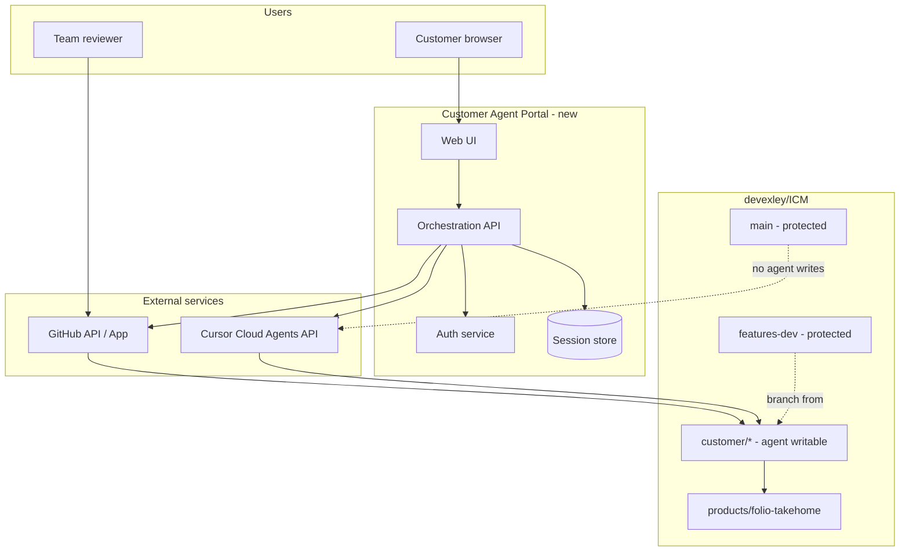
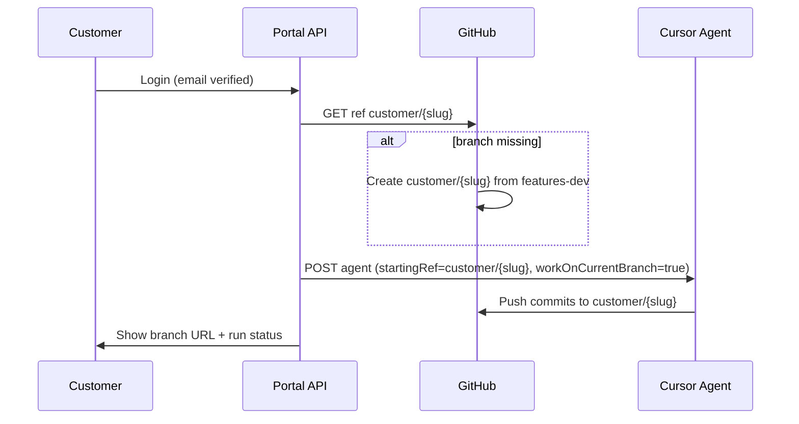

# Customer Agent Portal — Architecture & Benefit Analysis

**Repository:** [devexley/ICM](https://github.com/devexley/ICM)  
**Integration base branch:** `features-dev`  
**Protected refs:** `main`, `features-dev`  
**Primary product (v1):** `products/folio-takehome/`  
**Status:** Design document (not implemented)  
**Last updated:** 2026-05-26

---

## Executive summary

This document describes a **Customer Agent Portal**: a public-facing (or invite-only) web experience where a customer signs in with **email**, receives a **dedicated git branch** forked from `features-dev`, and uses a **Cursor Cloud Agent** to implement and test Folio features on that branch only. `main` and `features-dev` remain protected; integration happens via optional pull requests when the team accepts work.

The ICM portfolio hub already provides **scoped AI context** (CONTEXT.md, stages, verify commands). The portal adds **identity, git isolation, and agent orchestration**—capabilities the hub does not include today.

---

## Benefit analysis

### Problems today

| Gap | Impact |
|-----|--------|
| No customer identity | Cannot attribute work, resume sessions, or enforce quotas |
| Shared branch risk | Ad-hoc work on `features-dev` blocks others and mixes unrelated changes |
| Manual agent setup | Each customer must clone, configure Cursor, and learn ICM routing |
| Opaque progress | Reviewers cannot see a clear branch-per-customer story in git history |

### Benefits with the portal

| Benefit | Who gains | How |
|---------|-----------|-----|
| **Safe experimentation** | Customers | Changes land on `customer/{email-slug}` only; protected branches stay read-only for the agent |
| **Repeatable ICM workflow** | Customers & reviewers | Agent loads product CONTEXT + stage contracts; verify stage commands run automatically |
| **Clear audit trail** | Engineering / PM | One branch per email; commits tell a per-customer story |
| **Faster time-to-try** | Customers | No local Cursor install required for v1 (cloud agent in browser) |
| **Controlled promotion** | Team | PR from customer branch → `features-dev` when ready; `main` unchanged until release process |
| **Scalable review** | Team | Review diffs and CI on `customer/*` without touching integration branch |
| **Hub leverage** | Org | Reuses existing `validate_icm.py`, Folio Docker tests, and stage outputs as agent contracts |

### Costs and tradeoffs

| Cost | Mitigation |
|------|------------|
| Cursor API usage (cloud runs) | Per-email quotas, max run duration, queue |
| GitHub App maintenance | Scoped permissions; `customer/*` write only |
| Abuse / prompt injection | Rate limits, captcha, invite-only beta, content policy |
| Branch sprawl | Naming convention; stale-branch cleanup job (90-day inactive) |
| Not true multi-tenant isolation | Single repo + branch model; fork-per-customer if compliance requires stronger isolation |

### Recommendation

**Proceed with a phased MVP** on the existing monorepo model (one repo, branch per customer). Re-evaluate fork-per-customer only if legal/compliance requires hard repository separation.

---

## Goals and non-goals

### Goals (v1)

1. Email-based login (magic link or OAuth).
2. On first login: create `customer/{email-slug}` from `features-dev` if it does not exist.
3. Launch and resume Cursor Cloud Agents that commit **only** to that branch (`workOnCurrentBranch: true`).
4. Inject ICM context (hub + product + relevant stage) into every agent prompt envelope.
5. Run Folio verification (`docker compose` + `tests/test.php`) after agent runs when possible.
6. Expose branch URL, run status, and test summary in the portal UI.

### Non-goals (v1)

- Merging automatically into `features-dev` or `main`
- Exposing Cursor API keys to the browser
- Replacing human review of stage `output/` artifacts
- Full ephemeral preview hosting (optional phase 2)

---

## System context



---

## Git branching model

### Branch roles

| Ref | Role | Agent write? | Human merge? |
|-----|------|--------------|--------------|
| `main` | Production / release line | **No** | Team only |
| `features-dev` | Shared feature integration | **No** | Team via PR |
| `customer/{email-slug}` | Per-customer sandbox | **Yes** (via cloud agent + scoped token) | Customer agent; team reviews PR |

### Email → branch slug

Rules (implement in `BranchService.slugify(email)`):

1. Lowercase entire email.
2. Replace `@` with `-at-`, `.` with `-`.
3. Strip characters outside `[a-z0-9-]`.
4. Collapse repeated hyphens; trim length to ≤ 80 chars.
5. Prefix: `customer/`.

**Examples:**

| Email | Branch |
|-------|--------|
| `jane@example.com` | `customer/jane-at-example-com` |
| `dev.patel@acme.co.uk` | `customer/dev-patel-at-acme-co-uk` |

### Branch lifecycle



### GitHub protection (required)

Configure on `devexley/ICM`:

- **`main`**: require PR, no force push, restrict pushes to admins/release role.
- **`features-dev`**: require PR for merges; block direct push from customer identities.
- **`customer/**`**: allow pushes from GitHub App used by portal; optional required status checks (ICM validate + Folio tests).

### Promotion path (human-gated)

```text
customer/jane-at-example-com  --PR-->  features-dev  --PR-->  main
```

Portal may offer **“Request review”** (opens PR with template); it must not auto-merge.

---

## Component architecture

### 1. Web UI (`portal-ui`)

- Chat-style interface: user message → agent run → streamed status.
- Panels: current branch, last commit, test results, link to GitHub compare view.
- No secrets in frontend; session cookie only.

### 2. Orchestration API (`portal-api`)

Responsibilities:

| Module | Responsibility |
|--------|----------------|
| `AuthController` | Magic link / OAuth; issue session JWT |
| `BranchService` | `ensureCustomerBranch(email)` via GitHub API |
| `AgentService` | Create/resume Cursor agents; map email → `agentId` |
| `ContextService` | Build ICM prompt prefix from CONTEXT files |
| `RunService` | Poll run status; persist transcript summary |
| `VerifyService` | Trigger or parse post-run test output |

Suggested stack: **Node (TypeScript)** or **Python (FastAPI)** — align with team preference; Python matches existing `scripts/` tooling.

### 3. Session store

Minimal schema:

```sql
-- illustrative
users (id, email, email_verified_at, created_at)
customer_branches (user_id, branch_name, github_ref_sha, created_at, last_push_at)
agent_sessions (user_id, cursor_agent_id, branch_name, created_at, last_active_at)
agent_runs (id, session_id, cursor_run_id, status, prompt_summary, result_text, created_at)
```

### 4. GitHub App

**Permissions (minimum):**

| Permission | Access | Why |
|------------|--------|-----|
| Contents | Read on repo; write refs under `customer/*` | Create branch, receive agent pushes |
| Pull requests | Read & write (optional v1) | Open PR to `features-dev` on user request |
| Metadata | Read | Repo resolution |

**Events (optional):** `push` on `customer/**` → trigger CI workflow.

Installation: org `devexley`, repository `ICM` only.

### 5. Cursor Cloud Agents

Use **Cloud Agents API** or **Cursor SDK** (`@cursor/sdk` / `cursor-sdk`) with explicit `cloud` runtime.

**Critical API behavior (2026):**

- Custom `branchName` in API body is **removed**; default agent branches are `cursor/...`.
- To use **email-named branches**: pre-create branch on GitHub, then set `workOnCurrentBranch: true` and `startingRef` to `customer/{slug}`.

---

## API design (portal)

Base path: `/api/v1`

### Auth

| Method | Path | Description |
|--------|------|-------------|
| `POST` | `/auth/magic-link` | Body: `{ "email" }` → send link |
| `GET` | `/auth/verify?token=...` | Verify → session cookie |
| `POST` | `/auth/logout` | Clear session |
| `GET` | `/auth/me` | `{ email, branch }` |

### Branch

| Method | Path | Description |
|--------|------|-------------|
| `POST` | `/branch/ensure` | Idempotent create/sync from `features-dev` |
| `GET` | `/branch` | `{ name, url, aheadBehindFeaturesDev }` |

### Agent

| Method | Path | Description |
|--------|------|-------------|
| `POST` | `/agent/runs` | Body: `{ "message" }` → start or continue agent |
| `GET` | `/agent/runs/:runId` | Status, git branches, result text |
| `GET` | `/agent/runs/:runId/stream` | SSE of assistant deltas (proxy Cursor stream) |
| `POST` | `/agent/runs/:runId/cancel` | Cancel if supported |

### Review (optional v1)

| Method | Path | Description |
|--------|------|-------------|
| `POST` | `/review/request-pr` | Open PR `customer/{slug}` → `features-dev` |

---

## Cursor agent launch contract

### REST example (`POST https://api.cursor.com/v1/agents`)

```json
{
  "prompt": {
    "text": "<ICM_CONTEXT_BLOCK>\n\nUser request:\nAdd scheduled publishing per README feature 1."
  },
  "model": {
    "id": "composer-2.5"
  },
  "repos": [
    {
      "url": "https://github.com/devexley/ICM",
      "startingRef": "customer/jane-at-example-com"
    }
  ],
  "workOnCurrentBranch": true,
  "autoCreatePR": false,
  "skipReviewerRequest": true
}
```

### TypeScript SDK example

```typescript
import { Agent } from "@cursor/sdk";

await using const agent = await Agent.create({
  apiKey: process.env.CURSOR_API_KEY!,
  model: { id: "composer-2.5" },
  cloud: {
    repos: [
      {
        url: "https://github.com/devexley/ICM",
        startingRef: branchName, // customer/jane-at-example-com
      },
    ],
    workOnCurrentBranch: true,
    autoCreatePR: false,
    skipReviewerRequest: true,
  },
});

const run = await agent.send(userMessage);
await run.wait();
```

### Python SDK example

```python
from cursor_sdk import Agent, CloudAgentOptions, CloudRepository

branch = "customer/jane-at-example-com"
with Agent.create(
    model="composer-2.5",
    api_key=os.environ["CURSOR_API_KEY"],
    cloud=CloudAgentOptions(
        repos=[
            CloudRepository(
                url="https://github.com/devexley/ICM",
                starting_ref=branch,
            )
        ],
        work_on_current_branch=True,
        auto_create_pr=False,
        skip_reviewer_request=True,
    ),
) as agent:
    result = agent.send(user_message).text()
```

### Resume follow-up session

```typescript
await using const agent = await Agent.resume(storedAgentId, {
  apiKey: process.env.CURSOR_API_KEY!,
});
const run = await agent.send("Add tests for the publishing scheduler.");
await run.wait();
```

Poll `GET /v1/agents/{id}/runs/{runId}` for `git.branches[]` and terminal `result`.

---

## ICM context envelope

Prepend to every user message so the agent stays scoped:

```markdown
# ICM Agent Contract (mandatory)

You are working in the ICM portfolio hub for product **folio** only.

## Routing
1. Read context from branch paths (do not assume other products exist).
2. Implement only under `products/folio-takehome/`.
3. Follow `products/folio-takehome/CONTEXT.md` and the current stage in `stages/03_implement/` unless user directs otherwise.

## Git rules
- You may commit only to the current branch: {branchName}.
- Do NOT modify, merge, or push to `main` or `features-dev`.
- Do not commit `stages/*/output/*` (gitignored run artifacts).

## Verification (run before claiming done)
cd products/folio-takehome
docker compose exec app php tests/test.php

## Hub validate (if hub files changed)
python3 scripts/validate_icm.py

---

User request:
{userMessage}
```

`ContextService` can load file snippets from the checked-out branch at run time (in portal backend after GitHub tarball/API) or rely on the cloud VM clone containing current branch files.

---

## Verification and CI

### Post-agent checks (cloud VM)

The Cursor cloud VM clones the repo at the customer branch; the agent can run:

```bash
cd products/folio-takehome
docker compose up -d
docker compose exec app php tests/test.php
python3 ../../scripts/validate_icm.py
```

Portal surfaces exit codes in the run record.

### GitHub Actions (recommended)

Workflow: `.github/workflows/customer-branch-ci.yml`

```yaml
on:
  push:
    branches:
      - 'customer/**'
  pull_request:
    branches:
      - features-dev

jobs:
  verify:
    runs-on: ubuntu-latest
    steps:
      - uses: actions/checkout@v4
      - run: python3 scripts/validate_icm.py
      - run: |
          cd products/folio-takehome
          docker compose up -d --wait
          docker compose exec -T app php tests/test.php
```

### Local customer testing (fallback)

Document in portal:

```bash
git fetch origin customer/your-branch
git checkout customer/your-branch
cd products/folio-takehome && docker compose up
```

---

## Security model

| Threat | Control |
|--------|---------|
| API key theft | Keys only on server; never in browser |
| Writing to protected branches | GitHub branch protection + agent `startingRef` only on `customer/*` |
| Cross-customer access | Session binds email → branch; authorize every API call |
| Resource exhaustion | Rate limit runs per email/day; max concurrent runs |
| Malicious code in repo | Code review before merge; CI on `customer/**` |
| PII in branch names | Slug encodes email — acceptable for private beta; use opaque UUID slugs if needed |

### Identity options (v1 pick one)

1. **Magic link** — lowest friction; good for beta.
2. **Google OAuth** — faster for enterprise customers; map to email.

---

## Repository layout (proposed)

```text
integration/
  customer-agent-portal-architecture.md   # this document
  output/
    integration-plan.md                   # implementation checklist (future)
    smoke-test.md                         # portal E2E (future)

products/customer-agent-portal/           # new product (suggested)
  CONTEXT.md
  portal-api/
  portal-ui/
  _config/conventions.md

.github/workflows/
  customer-branch-ci.yml
```

Register `customer-agent-portal` in hub `CONTEXT.md` when implementation starts.

---

## Implementation phases

### Phase 0 — Prerequisites (1–2 days)

- [ ] GitHub App created; branch protection on `main`, `features-dev`
- [ ] Cursor team API key / service account with cloud agent access to `devexley/ICM`
- [ ] Decide: public beta vs invite-only allowlist

### Phase 1 — MVP (1–2 weeks)

- [ ] `BranchService.ensureCustomerBranch(email)`
- [ ] Magic-link auth + session store
- [ ] `POST /agent/runs` → Cursor cloud agent with ICM envelope
- [ ] UI: login, chat, branch link, run status
- [ ] Manual PR instructions (no auto-PR)

### Phase 2 — Hardening (1 week)

- [ ] GitHub Action on `customer/**`
- [ ] Rate limits and run quotas
- [ ] `Agent.resume` for returning customers
- [ ] “Request PR to features-dev” button

### Phase 3 — Optional

- [ ] Ephemeral preview (Codespaces or deploy hook per branch)
- [ ] Stage `output/` upload to portal (not git) for human review
- [ ] Multi-product picker in hub `CONTEXT.md`

---

## Smoke test checklist (acceptance)

1. New email login creates `customer/{slug}` from `features-dev`.
2. Second login reuses same branch (no duplicate).
3. Agent run commits only to `customer/{slug}`; `features-dev` unchanged on remote.
4. `python3 scripts/validate_icm.py` passes on customer branch after agent run.
5. Folio `tests/test.php` passes in CI for customer branch push.
6. Attempt to configure agent with `startingRef: features-dev` is rejected by portal policy.
7. Session A cannot read or trigger runs for session B’s branch.

---

## Open decisions

| Decision | Options | Suggestion |
|----------|---------|------------|
| Portal hosting | Vercel + Railway, single VPS, internal only | Internal Fly.io/Railway for beta |
| Slug vs opaque ID | `customer/jane-at-...` vs `customer/uuid` | Email slug for v1; opaque if GDPR concern |
| Auto-PR | Off vs on merge to `features-dev` | Off; human opens PR |
| Product scope | Folio only vs hub-wide | Folio only for v1 |

---

## References

| Resource | URL |
|----------|-----|
| ICM hub routing | `CONTEXT.md` |
| Folio product | `products/folio-takehome/CONTEXT.md` |
| Cursor Cloud Agents API | https://cursor.com/docs/cloud-agent/api/endpoints |
| Cursor TypeScript SDK | https://cursor.com/docs/sdk/typescript |
| Cursor Python SDK | https://cursor.com/docs/sdk/python |
| Interpretable Context Methodology | https://arxiv.org/abs/2603.16021 |

---

## Document history

| Date | Change |
|------|--------|
| 2026-05-26 | Initial architecture and benefit analysis |
